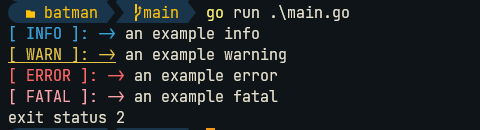
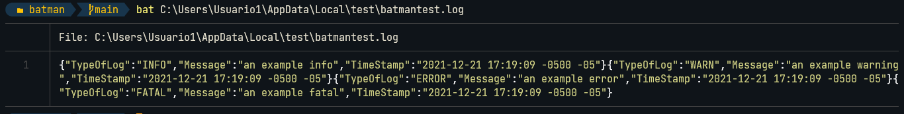

<div align="center">
  <p>
    
  </p>
  <h1>The most powerfull and faster logger for golang powered by DC</h1>
  <hr>
  
  
  
</div>

# :thinking: What is this?

Well this is a simple logger created with some tools and colors :sunglasses:

## :eyes: How see this in action ?

- Terminal color action



- Json file generator



# :keyboard: How install this ?

```
go get -u github.com/TeoDev1611/batman/log
```

# :ok_hand: Examples

```go
package main

import (
	"github.com/TeoDev1611/batman/log" // Import the log library
)

func main() {
	log.Config.AppName = "YourAppName" // Add the app name for the folder to create the logs
	log.Config.FileToLog = "filetolog.log" // Add the name for the file to write the logs ( JSON FORMAT )
	err := log.Init() // Init the app
	if err != nil {
		panic(err)          // Check the errors
	}
	log.Info("an example info") // Make a info level logger
	log.Warning("an example warning") // Make a warning logger
	log.Error("an example error") // Make a error logger
	log.Fatal("an example fatal") // Make a fatal
	print("this will be not printed") // WHY THIS NOT PRINT ( Make a os exit status 2 for the fatal)
  // DISABLE ?? Check the customization opts
}
```

- Customization examples

```go
package main

import (
	"github.com/TeoDev1611/batman/log" // Import the log library
)

func init(){
  log.LogOpts.Error = "CUSTOM_KEY_ERROR" // Custom the key for the json file in the error level DEFAULT: ERROR
  log.LogOpts.Info = "CUSTOM_KEY_INFO" // Custom the key for the json file in the info level DEFAULT: INFO
  log.LogOpts.Warning = "CUSTOM_KEY_WARN" // Custom the key for the json file in the warn level DEFAULT: WARN
  log.LogOpts.Fatal = "CUSTOM_KEY_FATAL" // Custom the key for the json file in the fatal level DEFAULT: FATAL

  log.LogOpts.ErrorExit = true // Exit the program with 2 code in the error logs DEFAULT: false
  log.LogOpts.FatalExit = true // Exit the program with 2 code in the fatal logs DEFAULT: true
}
```

# :books: Steps to contribute

1. Make a Fork to this repository
2. Make a branch with the feature to add
3. Use the conventional commits guide [more information here](https://www.conventionalcommits.org/en/v1.0.0/)
4. Make a pull request with a explanation what you changes or features
5. Review your pull request :shipit:
6. Merge the pull request or request changes
7. Done! :smiley:

# :mega: Credits

Special thanks to [Ashley Willis](https://twitter.com/ashleymcnamara) were i stracted the gopher batman image [here](https://twitter.com/ashleymcnamara/status/879796984491540480/photo/2)

---

Made with :heart: in Ecuador
