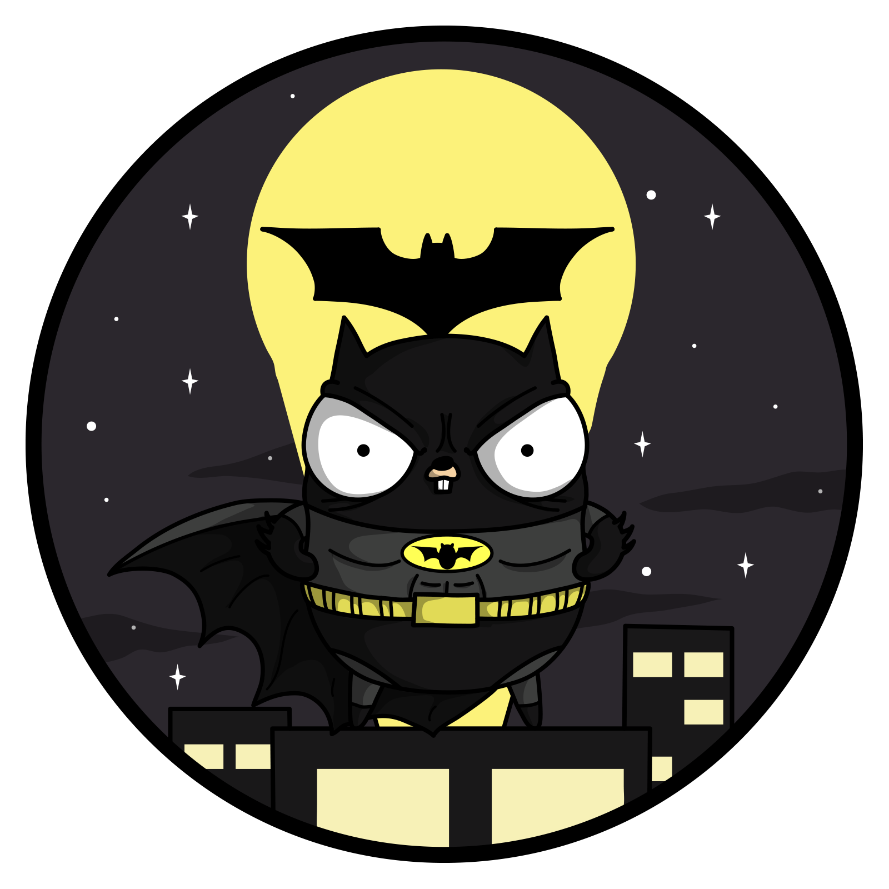
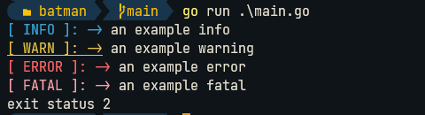
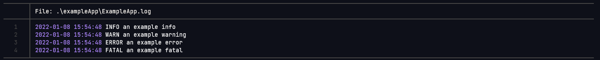

<div align="center">
  <p>
    
  </p>
  <h1>The most powerfull and faster logger for golang powered by DC</h1>
  <hr>
  
  
  
  <a href="https://www.buymeacoffee.com/teodev1611" target="_blank"></a>
</div>

# :thinking: What is this?

Well this is a simple logger created with some tools and colors :sunglasses:

## :eyes: How see this in action ?

- Terminal color action



- Log file generator



# :keyboard: How install this ?

```bash
go get -u github.com/TeoDev1611/batman/log
```

# :rocket: New Features (v2)

`batman` has evolved into a production-ready logger with advanced features.

### 1. Structured Logging (JSON)
Logs can be generated as structured JSON objects, making them compatible with ELK, Splunk, and other analysis tools.

```go
log.Config.JSONFormat = true
```

### 2. Async Logging
Offload log writes to a background worker to avoid blocking your application. Ideal for high-performance systems.

```go
log.Config.Async = true
log.Config.BufferSize = 100 // Optional: defaults to 100
// IMPORTANT: Always call Close() to flush pending logs
defer log.Close() 
```

### 3. Context Support (Fields)
Add metadata to your logs without cluttering the main message.

```go
log.WithFields(map[string]interface{}{
    "user_id": 123,
    "action": "login",
}).Info("User authenticated")
```

### 4. Log Rotation
Prevent log files from growing infinitely. `batman` will automatically rotate files when they reach a certain size.

```go
log.Config.MaxSize = 10 * 1024 * 1024 // 10MB (in bytes)
log.Config.MaxBackups = 3            // Keep 3 old log files
```

# :ok_hand: Examples

Check the [examples](./examples) folder for more in-depth usage:
- [Basic usage](./examples/basic/main.go)
- [Advanced features (Async, JSON, Fields)](./examples/advanced/main.go)

### Basic usage

```go
package main

import (
	"github.com/TeoDev1611/batman/log"
)

func main() {
	log.Config.AppName = "YourAppName" 
	log.Config.FileToLog = "filetolog.log" 
	err := log.Init() 
	if err != nil {
		panic(err)
	}
	log.Info("an example info") 
	log.Warning("an example warning") 
	log.Error("an example error") 
	log.Fatal("an example fatal") 
	log.Debug("an example debug") 
}
```

# :rocket: Roadmap for v2

We are planning a major update for v2! Check out our [TODO.md](./TODO.md) for more information. 
- [x] Structured logging (JSON support)
- [x] Log rotation
- [x] Async logging
- [ ] Custom formatters interface
- [x] Context support (adding fields to logs)

- Customization examples

```go
package main

import (
	"github.com/TeoDev1611/batman/log" // Import the log library
)

func init(){
  log.LogOpts.Error = "CUSTOM_KEY_ERROR" // Custom the key for the log file in the error level DEFAULT: ERROR
  log.LogOpts.Info = "CUSTOM_KEY_INFO" // Custom the key for the log file in the info level DEFAULT: INFO
  log.LogOpts.Warning = "CUSTOM_KEY_WARN" // Custom the key for the log file in the warn level DEFAULT: WARN
  log.LogOpts.Fatal = "CUSTOM_KEY_FATAL" // Custom the key for the log file in the fatal level DEFAULT: FATAL

  log.LogOpts.ErrorExit = true // Exit the program with 2 code in the error logs DEFAULT: false
  log.LogOpts.FatalExit = true // Exit the program with 2 code in the fatal logs DEFAULT: true
}
```

# :books: Steps to contribute

1. Make a Fork to this repository
2. Make a branch with the feature to add
3. Use the conventional commits guide [more information here](https://www.conventionalcommits.org/en/v1.0.0/)
4. Make a pull request with a explanation what you changes or features
5. Review your pull request :shipit:
6. Merge the pull request or request changes
7. Done! :smiley:

# :moneybag: Support

If you find this project useful, consider supporting its development!

[](https://www.buymeacoffee.com/teodev1611)

For more information on how to support this project, check out [SUPPORT.md](./docs/SUPPORT.md).

# :mega: Credits

Special thanks to [Ashley Willis](https://twitter.com/ashleymcnamara) were i stracted the gopher batman image [here](https://twitter.com/ashleymcnamara/status/879796984491540480/photo/2)

---

Made with :heart: in Ecuador
